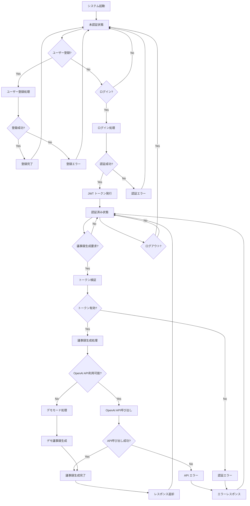
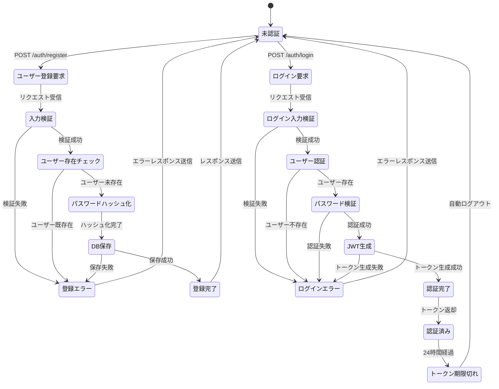
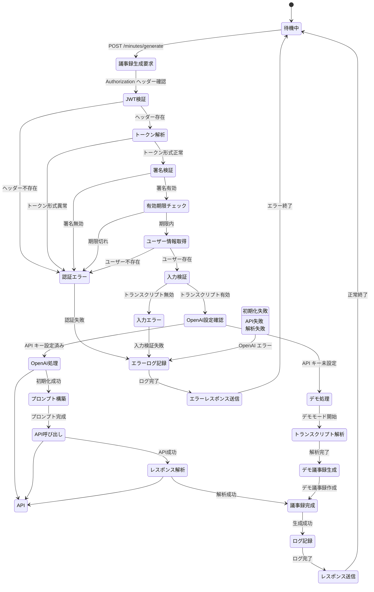
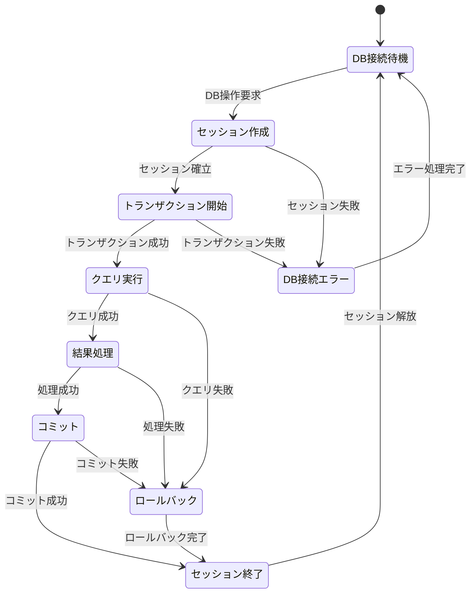
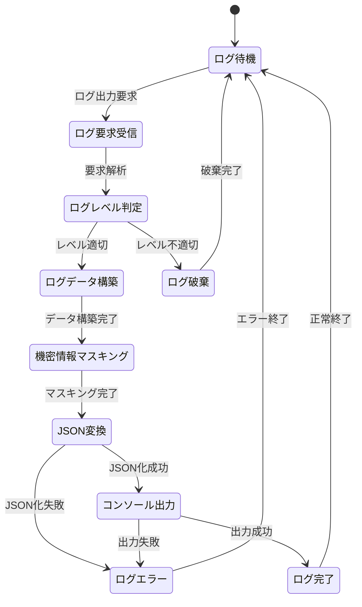

# トランスクリプト議事録作成API 実装計画書

## 概要
Teams会議のトランスクリプトからOpenAIを使用して議事録を自動生成するFastAPI Webアプリケーションの実装計画書です。JWT認証、データベース連携、ログ機能を含む完全なAPIシステムを構築します。

## システム要件

### 機能要件
- **議事録生成**: OpenAI APIを使用してトランスクリプトから議事録を自動生成
- **認証システム**: JWT トークンベースの認証機能
- **ユーザー管理**: データベースでのUserID/Password管理
- **ログ機能**: コンソール出力によるリクエスト/レスポンスログ
- **環境設定**: 外部化された環境変数管理

### 技術要件
- **フレームワーク**: FastAPI
- **認証**: JWT (JSON Web Token)
- **AI統合**: OpenAI API
- **データベース**: SQLite (開発用) / PostgreSQL (本番用)
- **ログ**: Python標準ログライブラリ
- **環境管理**: python-dotenv

## ディレクトリ構成

```
project/
├── .env                    # 環境変数設定
├── requirements.txt        # 依存関係
├── main.py                # FastAPIアプリケーションエントリーポイント
├── database.py            # データベース設定
├── routers/               # APIルーター
│   ├── __init__.py
│   ├── auth.py           # 認証関連エンドポイント
│   └── minutes.py        # 議事録生成エンドポイント
├── modules/               # ビジネスロジック
│   ├── __init__.py
│   ├── auth_manager.py   # JWT認証管理
│   ├── openai_client.py  # OpenAI API クライアント
│   ├── minutes_generator.py # 議事録生成ロジック
│   └── logger.py         # ログ管理
├── schemas/               # Pydanticモデル
│   ├── __init__.py
│   ├── auth.py           # 認証関連スキーマ
│   ├── user.py           # ユーザー関連スキーマ
│   └── minutes.py        # 議事録関連スキーマ
└── models/                # データベースモデル
    ├── __init__.py
    └── user.py           # ユーザーテーブルモデル
```

## データベース設計

### Userテーブル
```sql
CREATE TABLE users (
    id INTEGER PRIMARY KEY AUTOINCREMENT,
    user_id VARCHAR(50) UNIQUE NOT NULL,
    password_hash VARCHAR(255) NOT NULL,
    created_at TIMESTAMP DEFAULT CURRENT_TIMESTAMP,
    updated_at TIMESTAMP DEFAULT CURRENT_TIMESTAMP
);
```

## API エンドポイント設計

### 認証エンドポイント
- `POST /auth/login` - ログイン（JWT トークン取得）
- `POST /auth/register` - ユーザー登録

### 議事録生成エンドポイント
- `POST /minutes/generate` - 議事録生成（JWT認証必須）

## スキーマ定義

### 認証関連
```python
# schemas/auth.py
class LoginRequest(BaseModel):
    user_id: str
    password: str

class LoginResponse(BaseModel):
    access_token: str
    token_type: str = "bearer"

class RegisterRequest(BaseModel):
    user_id: str
    password: str
```

### 議事録関連
```python
# schemas/minutes.py
class MinutesRequest(BaseModel):
    transcript: str

class MinutesResponse(BaseModel):
    meeting_minutes: str
    generated_at: datetime
```

## セキュリティ設計

### JWT認証
- **アルゴリズム**: HS256
- **有効期限**: 24時間
- **シークレットキー**: 環境変数で管理
- **ペイロード**: user_id, exp, iat

### パスワード管理
- **ハッシュ化**: bcrypt
- **ソルト**: 自動生成
- **検証**: bcrypt.checkpw()

## 環境変数設計

```env
# .env
# データベース設定
DATABASE_URL=sqlite:///./app.db

# JWT設定
JWT_SECRET_KEY=your-secret-key-here
JWT_ALGORITHM=HS256
JWT_ACCESS_TOKEN_EXPIRE_MINUTES=1440

# OpenAI設定
OPENAI_API_KEY=your-openai-api-key
OPENAI_MODEL=gpt-3.5-turbo

# アプリケーション設定
DEBUG=True
LOG_LEVEL=INFO
```

## ログ設計

### ログレベル
- **INFO**: 正常なリクエスト/レスポンス
- **WARNING**: 認証失敗、バリデーションエラー
- **ERROR**: API エラー、システムエラー
- **DEBUG**: 詳細なデバッグ情報

### ログ出力項目
- タイムスタンプ
- ログレベル
- エンドポイント
- ユーザーID（認証済みの場合）
- リクエストボディ
- レスポンスボディ
- 処理時間

## 実装手順

### Phase 1: 基盤構築
1. プロジェクト構造作成
2. 依存関係設定（requirements.txt）
3. 環境変数設定（.env）
4. データベース設定
5. ログ設定

### Phase 2: 認証システム
1. ユーザーモデル作成
2. JWT認証モジュール実装
3. 認証エンドポイント実装
4. パスワードハッシュ化実装

### Phase 3: 議事録生成システム
1. OpenAI クライアント実装
2. 議事録生成ロジック実装
3. 議事録生成エンドポイント実装
4. 認証ミドルウェア統合

### Phase 4: テスト・検証
1. 単体テスト実装
2. 統合テスト実行
3. セキュリティテスト
4. パフォーマンステスト

## 依存関係

```txt
fastapi==0.104.1
uvicorn[standard]==0.24.0
python-jose[cryptography]==3.3.0
passlib[bcrypt]==1.7.4
python-multipart==0.0.6
sqlalchemy==2.0.23
python-dotenv==1.0.0
openai==1.3.7
pydantic==2.5.0
```

## セキュリティ考慮事項

1. **認証トークン**: HTTPSでの送信必須
2. **パスワード**: 最小8文字、複雑性要件
3. **レート制限**: API呼び出し制限実装
4. **入力検証**: 全入力データのバリデーション
5. **ログ**: 機密情報のマスキング

## パフォーマンス考慮事項

1. **データベース**: インデックス最適化
2. **OpenAI API**: 非同期処理実装
3. **キャッシュ**: 頻繁なクエリのキャッシュ化
4. **ログ**: 非同期ログ出力

## 運用考慮事項

1. **ヘルスチェック**: `/health` エンドポイント
2. **メトリクス**: Prometheus対応
3. **ドキュメント**: OpenAPI自動生成
4. **デプロイ**: Docker対応

## テスト戦略

### 単体テスト
- 各モジュールの個別テスト
- モックを使用したAPI テスト
- バリデーションテスト

### 統合テスト
- エンドツーエンドテスト
- データベース統合テスト
- OpenAI API統合テスト

### セキュリティテスト
- 認証バイパステスト
- SQLインジェクションテスト
- XSSテスト

## 完成予定機能

✅ **認証システム**
- ユーザー登録・ログイン
- JWT トークン認証
- セキュアなパスワード管理

✅ **議事録生成**
- OpenAI統合
- トランスクリプト解析
- 構造化された議事録出力

✅ **ログ機能**
- 包括的なリクエスト/レスポンスログ
- エラーログ
- パフォーマンスログ

✅ **セキュリティ**
- JWT認証
- パスワードハッシュ化
- 入力検証

## 状態遷移図

### システム全体の状態遷移



### 認証フローの詳細状態遷移



### 議事録生成フローの詳細状態遷移



### データベース操作の状態遷移



### ログ処理の状態遷移



この実装計画に基づいて、段階的に開発を進めていきます。
